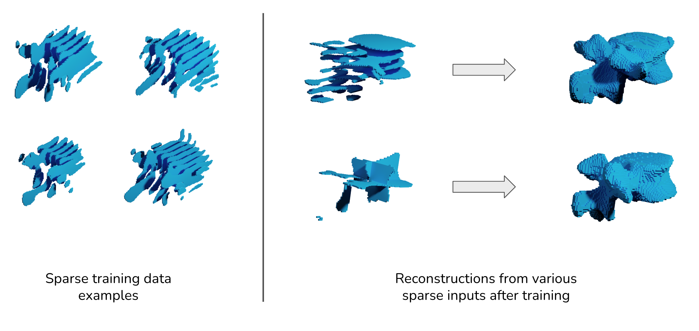

# Learning Shape Reconstruction from Sparse Measurements with Neural Implicit Functions



This repository provides our implementation of the [MIDL 2022 paper](https://openreview.net/forum?id=UuHtdwRXkzw). It presents a shape prior that can be trained on sparse segmentations with large slice distances, and is able to perform high resolution reconstructions from various sparse inputs.

If you use our work, please cite:

```
@inproceedings{amiranashvili2022learning,
  title={Learning Shape Reconstruction from Sparse Measurements with Neural Implicit Functions},
  author={Amiranashvili, Tamaz and L{\"u}dke, David and Li, Hongwei and Menze, Bjoern and Zachow, Stefan},
  booktitle={Proceedings of the Fifth Conference on Medical Imaging with Deep Learning},
  year={2022},
  publisher={PMLR}
}
```

### Requirements

The code was tested with Python 3.9.12 and PyTorch 1.11.0 with CUDA 11.3. Further dependencies are described in `requirements.txt` and `requirements-dev.txt` and can be installed via `pip`.

### Data

Segmentation labels are expected to be in the NIfTI file format.
Separation into training / test data is provided using so-called casename files. Casenames are unique identifiers of filenames of individual examples. They are stored in cleartext, with one casename per line. For reproducibility, the training/test splits used in the publication are provided in the `casename_files` directory for both datasets. Training/validation split happens in the code (reproducible through fixed seeds). 


### Training

The training is configured via two YAML files:

* `paths_config.yml`: this file provides paths to training/validation/test data and casename files, as well as target paths for storing trained models and for storing predicted reconstructions.
* `train_config.yml`: this file provides details of the model to be trained, such as sparsification step size and direction for generation of sparse training data. You can choose between our method (AD = Implicit AutoDecoder), as well as the ReconNet upper bound model (RN). Missing values are taken automatically from the default `train_config_default.yml` config file. Config files used in the publication are provided in the `config_files` directory for reproducibility.

Please refer to `train_config_default.yml` and `paths_config_default.yml` for documentation of individual parameters. To start the training, run the `impl_recon/train.py` file.

### Inference

The inference is also configured via two YAML files:
* `paths_config.yml`: same as above
* `eval_config.yml`: this file provides settings for reconstruction, such as slicing step size and direction for the sparse inputs. Missing values are taken automatically from the default `eval_config_default.yml` config file. Config files used in the publication are provided in the `config_files` directory for reproducibility.

Please refer to `eval_config_default.yml` and `paths_config_default.yml` for documentation of individual parameters. To start the reconstruction inference, run the `impl_recon/eval.py` file.

### Train/validation plots

You can find training/validation plots [here](training_plots.md).

### Third party code

Parts of the code are used from other repositories:

* evaluation metrics are adapted from [DeepMind](https://github.com/deepmind/surface-distance)
* ReconNet architecture is taken from the [official repository](https://github.com/FedeTure/ReconNet)
* patch-based inference (via sliding window) for ReconNet is adapted from [nnUNet](https://github.com/MIC-DKFZ/nnUNet)

### Contact

If you have any further questions, feel free to contact Tamaz Amiranashvili (firstname.lastname@uzh.ch)!
